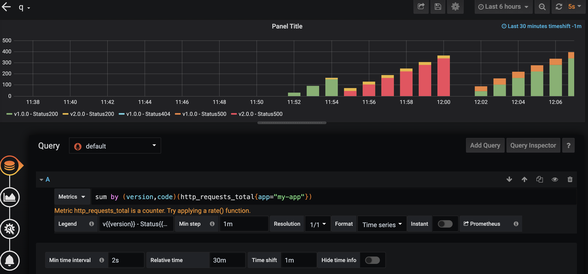
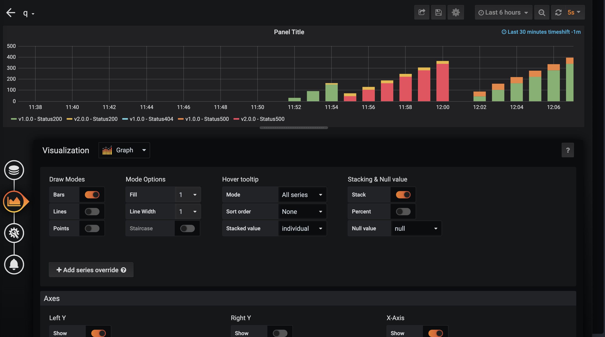

1. Install helm monitor
```
helm plugin install https://github.com/ContainerSolutions/helm-monitor
```

2. grafana setting
```
sum by (version,code)(http_requests_total{app="my-app"})
```

3. open a terminal, install/upgrade/rollback with helm
```
helm install --name my-app --set image.tag=1.0.0 ./app/charts

helm upgrade my-app --set image.tag=2.0.0 ./app/charts

helm monitor prometheus --interval=2 --prometheus=http://192.168.64.9:31857 my-app 'http_requests_total{code=~"^5.*$"} > 0'

```

4. open a new terminal 
```
app=$(minikube service my-app --url)

while sleep 1; do curl "$app"; done

while sleep 1; do curl "$app"/internal-error; done
```



---
https://github.com/ContainerSolutions/helm-monitor
